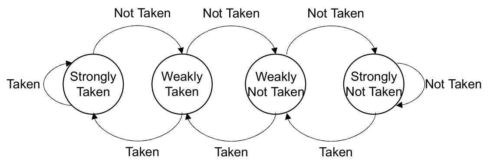

# Lab 4: Branch Prediction

CS 211 Advanced Computer Architecture, Fall 2025

**Grade: 3%**
**Deadline: 2025/11/30 (Sun) 23:59:59**

Only the **last active submission before the deadline** will be graded. Submissions that are deleted, deactivated, or late will not be considered.

**This is an individual lab. All work must be your own. Collaboration is not allowed.**

---

## 1. Objectives

The goal of this lab is to implement and compare several common branch prediction strategies. By completing this lab, you will gain a deeper understanding of how branch prediction influences CPU pipeline performance and control flow.

---

## 2. Background

In a pipelined processor, branches introduce **control hazards** because the actual branch target is not determined until the **Execute** stage. Branch prediction mitigates this by guessing the branch direction and target earlier -- typically during the **Decode** stage -- allowing the pipeline to continue fetching instructions without immediate stalling. A correct prediction avoids pipeline flushes, whereas a misprediction forces a pipeline flush, resulting in a significant performance penalty.

## 3. Tasks

### Task 1: Implement Branch Predictors

Your first task is to implement a module supporting multiple branch prediction strategies. The predictor maintains and updates an internal state during program execution and generates predictions based on features such as the branch instruction's address. You are required to implement the following predictors:

*   **Always Not Taken (NT)**: This static strategy always predicts that a branch will not be taken.
*   **Always Taken (AT)**: This static strategy always predicts that a branch will be taken.
*   **One-bit Predictor (1-Bit)**:
    *   A single, globally shared bit represents the predictor's state: `Taken` or `Not Taken` (initial state). When predicting, if the state is `Taken`, the branch is predicted as taken; otherwise, not taken.
    *   The state is updated based on the actual branch outcome: it is set to `Taken` if the branch is taken, and `Not Taken` otherwise.
*   **Two-bit Predictor (2-Bit)**:
    *   Maintain a **Branch History Table (BHT)** of a fixed size `K`. Each entry in the BHT is a 2-bit saturating counter representing one of four states: `Strongly Taken`, `Weakly Taken` (initial state), `Weakly Not Taken`, or `Strongly Not Taken`.
    *   To make a prediction, the branch instruction's Program Counter (`PC`) is mapped to a BHT entry. Predictions are made based on the entry's state: predict **taken** for `Strongly Taken` or `Weakly Taken`, and predict **not taken** otherwise.
    *   The mapping from `PC` to the table index (`IDX`) must remain static. For simplicity, you may use the modulo operation, i.e., `IDX = PC % K`. If you adopt this mapping, analyze and discuss in your report how `K` affects prediction accuracy. Relatively small values of `K` (e.g., $\leq 20$) often provide satisfactory accuracy.
    *   The state of the indexed entry is updated according to the actual branch target based on the following state transition diagram (the initial state and the final state are omitted).
*   **Perceptron Predictor**:
    *   You are required to read the paper [*Dynamic Branch Prediction with Perceptrons*](https://ieeexplore.ieee.org/document/903263) for a detailed description of this predictor.
    *   Implement its architecture, parameters, initialization process, and the prediction/update algorithms as described.
    *   In your report, detail your design decisions (including parameter choices), explain the prediction and update logic, and analyze its hardware cost, which may be approximated by its memory footprint.

You must implement the selection and configuration of these predictors using command-line arguments, parsed in `src/Options.h`, not via hard-coding. Refer to the Lab 3 template for examples of complex argument parsing. **It is crucial to document the usage of these options in your report so your code can be graded correctly.**

### Task 2: Implement the Branch Prediction Mechanism

You must integrate your predictor into the simulator's pipeline and correctly account for all control hazards as follows:

*   **Prediction:** Predictions are made in the **Decode** stage.
*   **Execution of Prediction:**
    *   If the prediction is **not taken**, the pipeline proceeds without any stall.
    *   If the prediction is **taken**, the `PC` is updated to the predicted target address in the **following cycle**. This incurs a **one-cycle control hazard penalty**.
*   **Resolution and Update:** In the **Execute** stage, the actual branch outcome is determined.
    *   The predictor's internal state (if any) is updated accordingly.
    *   If a **misprediction** occurred, the pipeline must be flushed (i.e., discard the instructions currently in the **Fetch** and **Decode** stages). This incurs a **two-cycle control hazard penalty**.

You are required to track branch prediction history and print a summary with the final `STATISTICS`, as shown in the example below:

```txt
------------ STATISTICS ----------
Number of Instructions: 469
Number of Cycles: 1220
Avg Cycles per Instruction: 2.6013
Number of Control Hazards: 142
Number of Data Hazards: 608
Branch Prediction Accuracy: 0.4651 (Always Not Taken)
----------------------------------
```

You must also implement verbose logging, controlled by the `--verbose` option, to trace the predictor's behavior. This includes logging the prediction made in the `Decode` stage, the actual outcome determined in the `Execute` stage, and any resulting pipeline stalls. Examples are provided below:

```txt
----------------------------------
WriteBack: addi
Memory Access: Bubble
Execute: Bubble
Decoded instruction 0x02c87a63 as bgeu a6,a2,52
  Branch prediction: taken (Always Taken)
Fetch: Bubble due to control hazard

----------------------------------
WriteBack: Bubble
Memory Access: Bubble
Execute: bgeu
  Branch prediction result: correct                 # case1: correct prediction
Decoded instruction 0x00f77793 as andi a5,a4,15
Fetched instruction 0x0a079063 at address 0x10464

----------------------------------
WriteBack: Bubble
Memory Access: Bubble
Execute: bgeu
  Branch prediction result: mispredicted            # case2: misprediction
Decode: Bubble due to control hazard
Fetch: Bubble due to control hazard
```

### Task 3: Evaluation

*   When comparing the different prediction strategies, you must first report their **key parameters** and corresponding **hardware costs** (simplified as memory footprint).

*   You are required to compare the **performance metrics** (e.g., accuracy, control hazards) among the baseline (no prediction) and each implemented strategy. You should use some or all of the provided test cases. If you find the existing test cases insufficient, you are encouraged to write your own and document their usage in your report. Your comparison and analysis of the different strategies must be presented in your report.

---

## 4. Report Requirements

Your lab report must be written in English and submitted in PDF format. It should include:

*   A detailed description of your design and implementation of the branch predictors and the pipeline integration mechanism.
*   A comprehensive evaluation comparing the predictors, covering their parameter settings, hardware costs, and measured performance, along with an analysis explaining the observed differences..

---

## 5. Pack for Submission

*   Add your report (`report.pdf`) to the project's root directory.
*   Modify `pack.sh` to include your name and student ID.
*   Run `bash pack.sh` to generate the submission archive.
