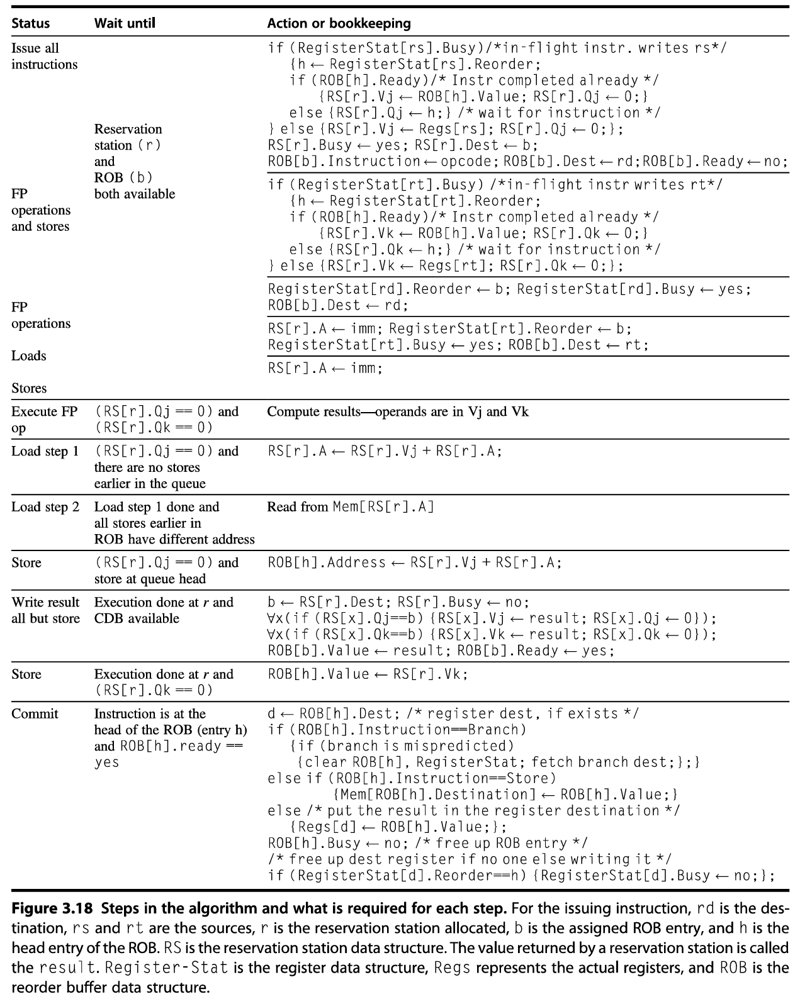

# Lab 5: Tomasulo's Algorithm

CS 211 Advanced Computer Architecture, Fall 2025

**Grade: 3%**
**Deadline: 2025/12/21 (Sun) 23:59:59**

Only the **last active submission before the deadline** will be graded. Submissions that are deleted, deactivated, or late will not be considered.

**This is an individual lab. All work must be your own. Collaboration is not allowed.**

---

## 1. Objectives

Upon completion of this laboratory assignment, students will be able to:

- Understand the limitations of traditional five-stage pipelines and the motivation for dynamic scheduling.
- Implement a hardware-based dynamic scheduling mechanism based on Tomasulo's algorithm with speculative execution.
- Apply register renaming techniques to eliminate WAR (Write-After-Read) and WAW (Write-After-Write) hazards.
- Integrate a Reorder Buffer (ROB) to support precise exceptions and speculative execution.

---

## 2. Background

Since there are many versions of Tomasulo's algorithm implementations, this laboratory is primarily based on Chapter 3.5 and 3.6 of [*Computer Architecture: A Quantitative Approach (6th Edition)*](https://acs.pub.ro/~cpop/SMPA/Computer%20Architecture,%20Sixth%20Edition_%20A%20Quantitative%20Approach%20(%20PDFDrive%20).pdf) (pages 193-219 are recommended for complete and coherent understanding). The following sections provide an overview and the implementation details of Tomasulo's algorithm.

### 2.1 Motivation: From In-Order to Dynamic Scheduling

Traditional five-stage pipelines (Fetch, Decode, Execute, Memory Access, Write-back) enforce **in-order instruction issue and execution**: instructions are issued in program order, and if an instruction stalls, no later instructions can proceed, even if they are independent. This creates **performance bottlenecks** when:

- Long-latency operations (e.g., division, memory access) block subsequent independent instructions.
- Multiple functional units remain idle despite having work available.
- Data hazards between closely-spaced instructions cause unnecessary stalls.

Consider this example:

```assembly
fdiv.d   f0, f2, f4   // 12 cycles
fadd.d  f10, f0, f8   // depends on fdiv.d, must wait
fsub.d  f12, f8, f14  // independent, but blocked by fadd.d stall
```

The `fsub.d` instruction has no data dependence on the preceding instructions, yet in a strict in-order pipeline it must still wait for both to complete.

**Dynamic scheduling** conceptually solves this problem by splitting instruction issue into two stages:
1. Issue: Decode instructions and check for structural hazards.
2. Read Operands: Wait until data hazards are resolved, then read operands.

This allows **out-of-order execution**: instructions execute as soon as their operands become available, not necessarily in program order.

Out-of-order execution introduces **WAR (anti-dependence) and WAW (output dependence) hazards** that do not exist in in-order pipelines:

```assembly
fdiv.d  f0,  f2,  f4  // writes f0
fmul.d  f6,  f0,  f8  // reads f0 (RAW dependence)
fadd.d  f0, f10, f14  // writes f0 (WAW with fdiv.d, WAR with fmul.d)
```

If `fadd.d` executes before `fmul.d` (which is waiting for `fdiv.d`), it violates the anti-dependence by overwriting `f0` before `fmul.d` reads it. Similarly, if `fadd.d` writes `f0` before `fdiv.d` completes, it violates the output dependence.

**Tomasulo's algorithm** eliminates these hazards through **register renaming**: architectural registers (like `f0`) are dynamically renamed to physical storage locations (reservation stations and ROB entries), so independent instructions operate on different physical locations even if they use the same register name.

### 2.2 Hardware-Based Speculation and Precise Exceptions

While dynamic scheduling handles data dependences, **control dependences** still limit parallelism. To maximize instruction-level parallelism, modern processors employ **hardware-based speculation**.

Speculation allows the processor to execute instructions beyond unresolved branches by predicting the branch outcome and continuing execution along the predicted path. However, out-of-order execution combined with speculation introduces a critical challenge: **maintaining precise exceptions**. In an in-order pipeline, exceptions naturally occur in program order. With out-of-order execution, an instruction that executes early may cause an exception before an earlier instruction that has not yet completed. Similarly, if a branch is mispredicted, all instructions fetched along the wrong path must be discarded without affecting architectural state.

Speculation extends Tomasulo's algorithm by adding a **Reorder Buffer (ROB)** that separates **instruction completion** (execution finished) from **instruction commit** (results written to architectural state). This allows the processor to maintain precise exceptions and undo speculative work when mispredictions occur. In this lab, branch outcomes are resolved during execution, but their architectural effects are enforced at commit via the ROB.

### 2.3 Hardware Components

#### 2.3.1 Reservation Stations (RS)

Reservation stations buffer instructions that have been issued but are waiting to execute. Instructions are dispatched to different types of reservation stations based on their operation type. Each reservation station type corresponds to a specific functional unit category, and multiple reservation stations of the same type may exist to enable parallel execution of independent instructions.

Each reservation station contains the following fields:

| Field | Description |
| :--- | :--- |
| `Op` | The operation to perform (e.g., `ADD`, `MUL`, `LOAD`, `STORE`). |
| `Vj`, `Vk` | Value of source operands when available. Only one of V-field or Q-field is valid per operand. |
| `Qj`, `Qk` | ROB entry numbers that will produce the source operands. Blank or `0` indicates the operand is ready in `Vj`/`Vk`. |
| `Dest` | ROB entry number where this instruction's result should be written. |
| `A` | For memory operations: holds immediate offset initially, then effective address after calculation. |
| `Busy` | Indicates whether this reservation station entry is occupied by an in-flight instruction. |

By storing operand values directly in reservation stations when available, instructions can execute immediately without accessing the register file, implementing a form of **distributed forwarding**.

#### 2.3.2 Reorder Buffer (ROB)

The ROB maintains program order for committing instructions. Each ROB entry contains:

| Field | Description |
| :--- | :--- |
| `Instruction` | Indicates whether the instruction is a `Branch` (and has no destination register), `Store` (and has a memory destination), or register operation (ALU operation or load, which has a register destination). |
| `State` | Instruction state: `Issue`, `Execute`, `Write Result` or `Commit`. |
| `Destination` | Register number (for ALU/`LOAD`) or memory address (for `STORE`). |
| `Value` | Result value after execution completes. |
| `Ready` | Indicates execution has completed and value is available. |

The ROB is organized as a **circular FIFO queue** with head and tail pointers:
- Instructions are allocated ROB entries at the **tail** during the Issue stage (in program order).
- Instructions commit from the **head** in program order.
- ROB entries serve as **tags** to identify results on the Common Data Bus (CDB).

#### 2.3.3 Register Status Table (RST)

For each architectural register, the register status table tracks:

| Field | Description |
| :--- | :--- |
| `Reorder` | ROB entry number of the youngest in-flight instruction that will write to this register. Blank or `0` means no pending write. |
| `Busy` | Indicates whether this register is the destination of an instruction currently in the ROB. |

This table enables **register renaming**: when an instruction needs a source operand, it checks the register status to determine if the value is in the register file (`Reorder` is `0`) or will be produced by a pending instruction (`Reorder` holds the ROB entry number).

#### 2.3.4 Load/Store Buffers

Load and store buffers handle memory operations:
- **Load buffers**: Calculate effective addresses, wait for memory unit availability, then fetch data.
- **Store buffers**: Calculate effective addresses and buffer store values until commit time.

In the software simulation, these can be implemented as specialized reservation stations for memory operations. The key requirement is maintaining **program order for address calculation** to detect memory hazards correctly. Stores only update memory at commit to ensure precise exceptions and correct memory ordering.

#### 2.3.5 Common Data Bus (CDB)

The CDB broadcasts completed instruction results to:
- All reservation stations waiting for that result (identified by matching ROB tag).
- The corresponding ROB entry.
- Any other structures that need the result.

As soon as an instruction completes execution, its result immediately becomes available to all dependent instructions without waiting for commit. In software simulation, you can model CDB broadcast using iterative loops to update all relevant structures (RS entries and ROB entries) rather than explicitly implementing a physical bus structure and interaction protocols.

### 2.4 Instruction Lifecycle

Instructions in a speculative Tomasulo processor proceed through four distinct stages. The algorithm details are illustrated in Figure 3.18 from the [textbook](https://acs.pub.ro/~cpop/SMPA/Computer%20Architecture,%20Sixth%20Edition_%20A%20Quantitative%20Approach%20(%20PDFDrive%20).pdf) (page 216, shown below). Although the figure uses floating-point operations as examples, the principles apply to all instruction types we support in this lab.



#### Stage 1: Issue

**Conditions to proceed**:
- An empty reservation station (`r`) of the appropriate type is available.
- An empty ROB entry (tail `b`) is available.

**Actions performed**:

Get an instruction from the instruction queue. Issue the instruction if there is an empty reservation station and an empty slot in the ROB; send the operands to the reservation station if they are available in either the registers or the ROB. Update the control entries to indicate the buffers are in use. The number of the ROB entry allocated for the result is also sent to the reservation station so that the number can be used to tag the result when it is placed on the CDB.

1. Decode instruction and determine operation type, then allocate reservation station `r` and ROB entry `b`. Store the operation in `RS[r].Op` and the instruction type in `ROB[b].Instruction`.
2. **For each source operand `rs`** (and `rt` if applicable, to which the same logic applies, using `Vk`/`Qk`):
   - If `RegisterStat[rs].Busy == true`:
     - `h <- RegisterStat[rs].Reorder`
     - If `ROB[h].Ready == true`: operand is ready in ROB, copy value `RS[r].Vj <- ROB[h].Value; RS[r].Qj <- 0`
     - Else: operand pending, record ROB tag `RS[r].Qj <- h`
   - Else: operand is ready in register file, copy value `RS[r].Vj <- Regs[rs]; RS[r].Qj <- 0`
3. **For register operations (ALU, LOAD)**: Update destination register (`rd` for ALU, `rt` for LOAD) status to point to this instruction's ROB entry (implements register renaming). Taking ALU as an example:
   - `RegisterStat[rd].Reorder <- b`
   - `RegisterStat[rd].Busy <- true`
   - `ROB[b].Destination <- rd`
4. **For memory operations**: Store immediate offset in `RS[r].A <- imm`
5. Mark reservation station as busy and associate it with the ROB entry: `RS[r].Busy <- true; RS[r].Dest <- b; ROB[b].Ready <- false`

The ROB is managed as a circular buffer. The ROB is considered full when advancing the tail pointer would make it equal to the head pointer; in that case, no new ROB entries can be allocated and instruction issue stalls.

#### Stage 2: Execute

**Actions for computation instructions**:
- If one or more of the operands is not yet available, monitor the CDB while waiting for the operand to be computed. This step checks for RAW hazards.
- When both operands are available at a reservation station (`Vj` and `Vk`), execute the operation. Instructions may take multiple clock cycles in this stage.

**Actions for LOAD instructions** (two-step process):
1. **Address calculation**: When base register ready (`Qj == 0`):
   - Compute effective address: `RS[r].A <- RS[r].Vj + RS[r].A`
2. **Memory access**: When Step 1 is done and all stores earlier in ROB have different addresses, ensuring no address conflicts with earlier stores:
   - Read from `Mem[RS[r].A]`

**Actions for STORE instructions** (only one step, the other step is split at Write Result stage):
- When the base register is ready (`Qj == 0`) and store is at ROB head, compute effective address:
   - `ROB[h].Destination <- RS[r].Vj + RS[r].A`

#### Stage 3: Write Result

**Conditions to proceed**:
- Execution completed at `r` and result ready.
- CDB available this cycle.

**Actions for all instructions except STORE**:

When the result is available, write it on the CDB (with the ROB tag sent when the instruction issued) and from the CDB into the ROB, as well as to any reservation stations waiting for this result. Mark the reservation station as available.

1. Broadcast `<ROB_Tag, Result_Value>` on CDB.
2. **Update ROB entry**: `b <- RS[r].Dest; ROB[b].Value <- result; ROB[b].Ready <- true`
3. **Update all reservation stations** waiting for this result:
   - For all `x`: If `RS[x].Qj == b`, then `RS[x].Vj <- result; RS[x].Qj <- 0`
   - For all `x`: If `RS[x].Qk == b`, then `RS[x].Vk <- result; RS[x].Qk <- 0`
4. Free reservation station: `RS[r].Busy <- false`

**Actions for STORE instructions**:
- When execution done at `r` and `RS[r].Qk == 0`: Write value to ROB: `ROB[b].Value <- RS[r].Vk`
- Memory is **NOT** updated yet; the store waits in ROB until commit.

#### Stage 4: Commit

**Conditions to proceed**:
- Instruction is at ROB head (entry `h`), enforcing program order.
- `ROB[h].Ready == true` (execution completed).

**Actions depend on instruction type**:

This is the final stage of completing an instruction, after which only its result remains. There are three different sequences of actions at commit depending on whether the committing instruction is a branch with an incorrect prediction, a store, or any other instruction (normal commit).

**Case 1: Branch instruction**:
- **If branch correctly predicted**:
  - Free ROB entry: `ROB[h].Ready <- false`
  - Continue normal execution
- **If branch mispredicted**:
  - **Flush** all ROB entries after the branch (from `h+1` to tail)
  - Clear all reservation stations marked with flushed ROB tags
  - Restore register status table: clear all `RegisterStat` entries
  - Restart execution at correct branch target address

**Case 2: Store instruction**:
- The normal commit case occurs when an instruction reaches the head of the ROB and its result is present in the buffer.
- Write to memory: `Mem[ROB[h].Destination] <- ROB[h].Value`
- Free ROB entry: `ROB[h].Ready <- false`

**Case 3: Register operation (ALU, LOAD)**:
- Write result to architectural register file: `Regs[d] <- ROB[h].Value` where `d = ROB[h].Destination`
- Clear register status if this ROB entry is still tagged: If `RegisterStat[d].Reorder == h`, set `RegisterStat[d].Busy <- false`
- Free ROB entry: `ROB[h].Ready <- false`

**Key principle**: Separating Write Result from Commit allows speculative execution while maintaining **precise exceptions**. If an exception occurs during execution, it is recorded in the ROB but not raised until that instruction reaches commit. If a branch misprediction flushes the instruction, the exception is discarded.

### 2.5 Register Renaming Mechanism

Register renaming in Tomasulo's algorithm happens implicitly through ROB tags:

1. **At Issue**: When instruction `I` writes register `Rd`, set `RegisterStat[Rd].Reorder = I's ROB entry number` and `RegisterStat[Rd].Busy = true`.
2. **At Issue of dependent instruction**: When a later instruction needs `Rd` as source, it finds `RegisterStat[Rd].Busy == true`, so it records the ROB tag (not the register name) as its source `Qj` or `Qk`.
3. **At Write Result**: Instruction `I` broadcasts `<ROB_tag, value>`, and all instructions waiting for that tag capture the value and clear their Q fields.
4. **At Commit**: Instruction `I` writes value to register file, and clears `RegisterStat[Rd].Busy` if no newer instruction has overwritten it.

This eliminates WAR and WAW hazards because multiple instructions writing the same architectural register actually write to different ROB entries, and consumers are explicitly tagged to the correct producer.

### 2.6 Memory Ordering and Hazards

To maintain correct program semantics, load and store operations must carefully handle memory hazards:

**RAW hazards through memory** are handled by:
- Not allowing a load to initiate the second step (access memory) if there is any earlier uncommitted store in the ROB whose address is unknown or matches the load's address.
- Maintaining the program order when computing the effective address of a load with respect to all earlier stores.

**WAW and WAR hazards through memory**:
- Eliminated by in-order commit: stores only update memory at commit, so memory writes happen in program order.
- Loads that execute speculatively may be squashed if a branch misprediction is detected.

---

## 3. Tasks

### Task 1: Implement ROB-Based Tomasulo's Algorithm

Implement Tomasulo's algorithm as described in Section 2, with the following reservation station type configuration:

| Reservation Station Type | Quantity | Instructions Supported |
| :--- | :---: | :--- |
| **ALU** | 4 | All integer ALU operations (ADD, SUB, AND, OR, XOR, SLT, etc.) |
| **MEM** | 2 | All memory operations (LOAD, STORE) |
| **MUL** | 4 | All M-extension multiplication/division (MUL, DIV, REM variants) |

**Instruction-to-reservation-station mapping**:
- M-extension instructions: dispatched to MUL reservation stations.
- Memory load/store instructions: dispatched to MEM reservation stations.
- All other instructions: dispatched to ALU reservation stations.

You can initialize the ROB size to 8.

For initial implementation, assume each stage (Execute for each operation type, Write Result, Commit) completes in **one cycle** (excluding the artificial delays introduced in Task 3). 

For simplicity, you may allow all ready instructions to access the CDB in the same cycle (i.e., multiple instructions can write their results in one cycle), or you may restrict the CDB to a single writer per cycle. In either case, only one instruction is allowed to commit in a given cycle.

To facilitate testing and comparison, use `pipeline_mode` option to control whether to use the five-stage simulator or the speculative Tomasulo simulator, and add corresponding CLI options to specialize hardware parameters (RS size, ROB size, etc.).

You should carefully consider when and how to fetch new instructions. You may either reserve a standalone `Fetch` stage, similar to the five-stage pipeline, or fetch instructions during the `Issue` stage as if they were already buffered in an instruction register or an instruction queue.

The provided algorithm (Section 2.4) significantly simplifies stores. You can also try more aggressive and practical optimizations (e.g., the store optimization described on Page 217 of the [textbook](https://acs.pub.ro/~cpop/SMPA/Computer%20Architecture,%20Sixth%20Edition_%20A%20Quantitative%20Approach%20(%20PDFDrive%20).pdf)).

### Task 2: Support RISC-V M-Extension

All test cases have been recompiled with M-extension support (`-march=rv32im`). You must implement the necessary M-extension instructions to run the test programs correctly. You can determine which instructions need to be implemented by running the test cases and examining the logs and assembly code. You do not need to implement unused M-extension instructions if they never appear in the provided test cases.

### Task 3: Introduce Execution Latency for M-Extension

To model realistic processor behavior, introduce **4 additional cycles of latency** during the Execute stage for all M-extension instructions (MUL, DIV, REM and their variants). Each M-extension instruction should therefore spend a total of 5 cycles in the Execute stage (1 base cycle + 4 additional cycles).

Also implement this latency in your classic five-stage pipeline simulator to enable fair performance comparisons between in-order and out-of-order execution.

It is recommended to add an `enable_execute_delay` flag to toggle latency on/off, which facilitates debugging and controlled performance evaluation.

### Task 4: Integrate Branch Prediction with Speculation

Integrate the branch predictor from your previous laboratory assignment (Lab 4) with the speculative Tomasulo implementation. You may use a simple predictor initially:
- **Always Taken**: Predict all branches as taken.
- **Always Not Taken**: Predict all branches as not taken.
- (Optional) More sophisticated predictors (e.g., 2-bit saturating counter, perceptron).

Verify that your implementation correctly handles both correct predictions and mispredictions, including flushing speculative instructions, restoring the microarchitectural state (ROB, RS, RST, etc.), and restarting fetch at the correct PC.

---

## 4. Report Requirements

### 4.1 Design and Implementation

Describe your design decisions and implementation details:
- Design overview.
- Data structure designs for ROB, RS, RST.
- Detailed explanation of your implementation of each pipeline stage (Issue, Execute, Write Result, Commit).
- How you handle edge cases:
  - ROB full condition.
  - Reservation station full condition (for specific types).
  - Branch misprediction recovery.
  - Memory ordering enforcement.

### 4.2 Correctness Verification

Document your testing and verification approach:
- Test cases used and expected vs. actual results.
- Evidence of correct branch misprediction recovery (e.g., by showing that the final architectural state matches that of the five-stage reference simulator).

### 4.3 Performance Analysis

Present your performance evaluation results:
- Performance comparison tables: cycle count, IPC for each test program (Tomasulo vs. five-stage), hazard count (for the speculative Tomasulo simulator, structural hazards should be included).
- Impact of M-extension latency on performance (with and without 4-cycle delay).
- Impact of microarchitectural parameters: ROB size, number of reservation stations per type.
- Branch prediction impact: misprediction rate and performance correlation.

### 4.4 (Optional) Discussion and Conclusions

Reflect on your implementation experience:
- Challenges encountered and how you resolved them.
- Insights gained about out-of-order execution and speculation.
- Any optimizations you made.

---

## 5. Pack for Submission

- Add your report (`report.pdf`) to the project's root directory.
- Modify `pack.sh` to include your name and student ID.
- Run `bash pack.sh` to generate the submission archive.

---

## Reference
- [Computer Architecture: A Quantitative Approach (6th Edition)](https://acs.pub.ro/~cpop/SMPA/Computer%20Architecture,%20Sixth%20Edition_%20A%20Quantitative%20Approach%20(%20PDFDrive%20).pdf)