### Task 3: Evaluation

*   When comparing the different prediction strategies, you must first report their **key parameters** and corresponding **hardware costs** (simplified as memory footprint).

*   You are required to compare the **performance metrics** (e.g., accuracy, control hazards) among the baseline (no prediction) and each implemented strategy. You should use some or all of the provided test cases. If you find the existing test cases insufficient, you are encouraged to write your own and document their usage in your report. Your comparison and analysis of the different strategies must be presented in your report.

---

## 4. Report Requirements

Your lab report must be written in English and submitted in PDF format. It should include:

*   A detailed description of your design and implementation of the branch predictors and the pipeline integration mechanism.

### implementation of the branch predictors:
#### 1. Always Not Taken (NT)
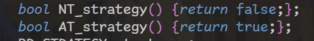

#### 2. Always Taken (AT)


#### 3. One-bit Predictor (1-Bit)
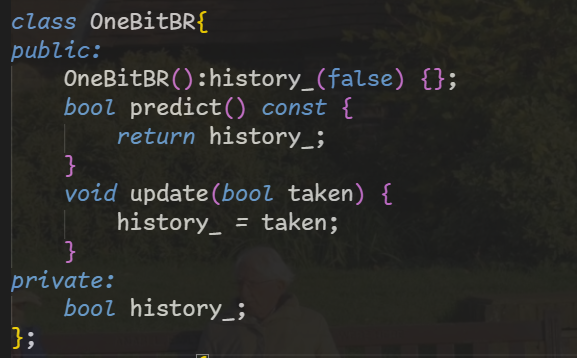

#### 4. Two-bit Predictor (2-Bit)
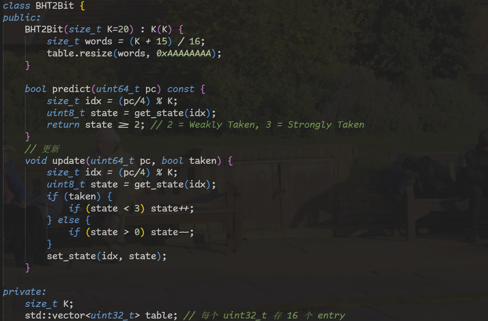

#### 5. Perceptron Predictor
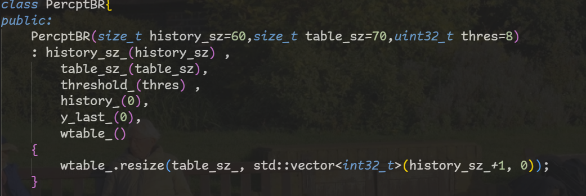
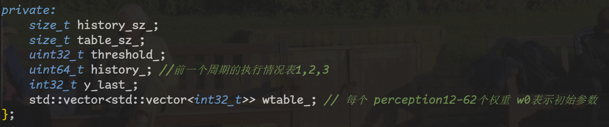
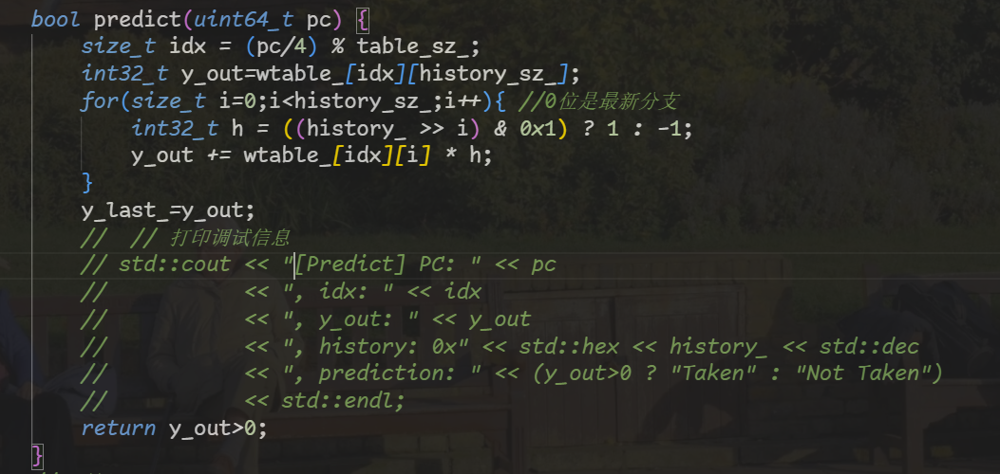
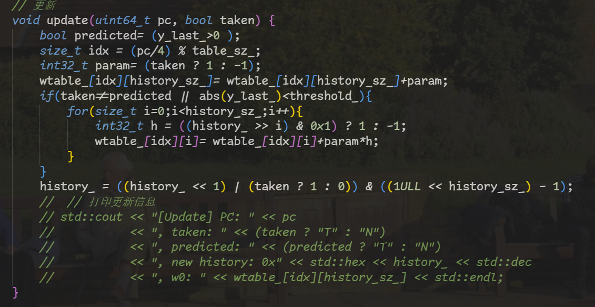

#### 6. Universal interface
```c
class BR_predict{
public:
//跳转地址的计算在deocde阶段由模拟器完成
//分支预测只决定是否跳转
    BR_predict(const Options& opts)
    :strategy_(opts.branch_predict_policy)
     {
        OB_ = std::make_unique<OneBitBR>();
        TB_ = std::make_unique<BHT2Bit>(opts.K);
        PB_ = std::make_unique<PercptBR>(opts.history_sz, opts.table_sz, opts.threshold);

     };
    bool strategy(uint64_t pc){
        switch(strategy_){
            case BR_STRATEGY::NT:
                return NT_strategy();
            case BR_STRATEGY::AT:
                return AT_strategy();
            case BR_STRATEGY::OB:
                return OB_->predict();
            case BR_STRATEGY::TB:
                return TB_->predict(pc);
            case BR_STRATEGY::PERCPT:
                return PB_->predict(pc);
            default:
                return NT_strategy();
        }
    };
    void UpdateStrategy(uint64_t pc, bool taken){
        switch(strategy_){
            case BR_STRATEGY::OB:
                OB_->update(taken);
                break;
            case BR_STRATEGY::TB:
                TB_->update(pc, taken);
                break;
            case BR_STRATEGY::PERCPT:
                PB_->update(pc, taken);
                break;
            default:
                break;
        }
    }
private:
    bool NT_strategy() {return false;};
    bool AT_strategy() {return true;};
    BR_STRATEGY strategy_;
    //1-bit saturating counter
  std::unique_ptr<OneBitBR> OB_ = nullptr;
    //2-bit
  std::unique_ptr<BHT2Bit> TB_ = nullptr;
    //
  std::unique_ptr<PercptBR> PB_ = nullptr;

};
```
### pipeline integration mechanism:
#### 1. support in data structure
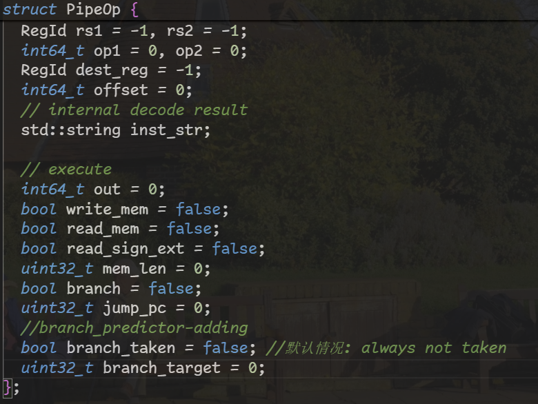

#### 2. predict address calculated in deocde stage
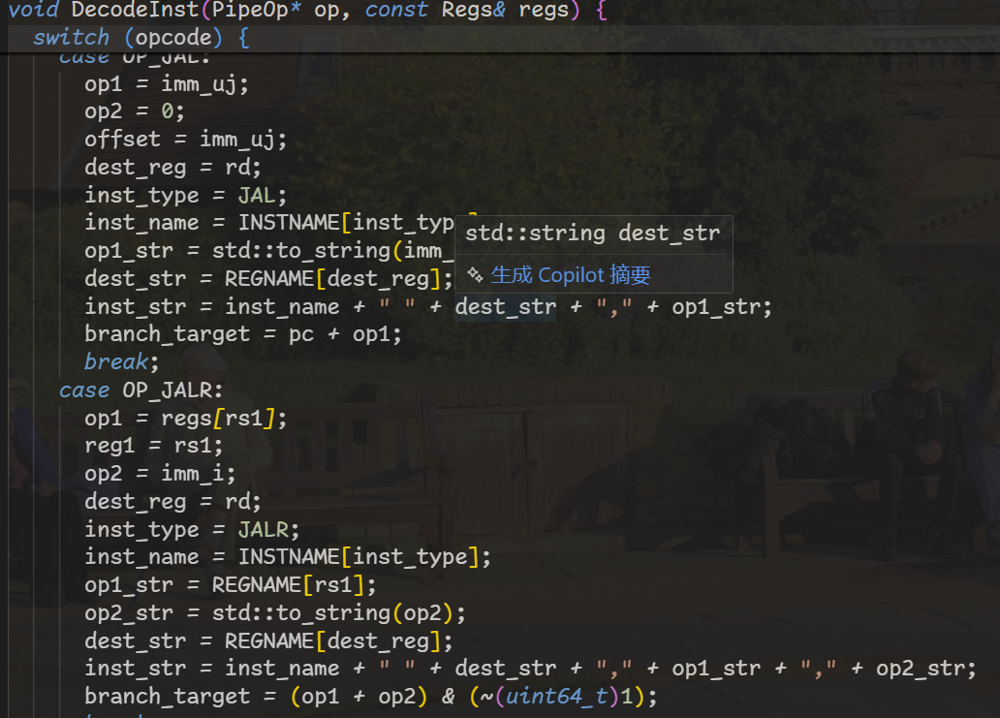

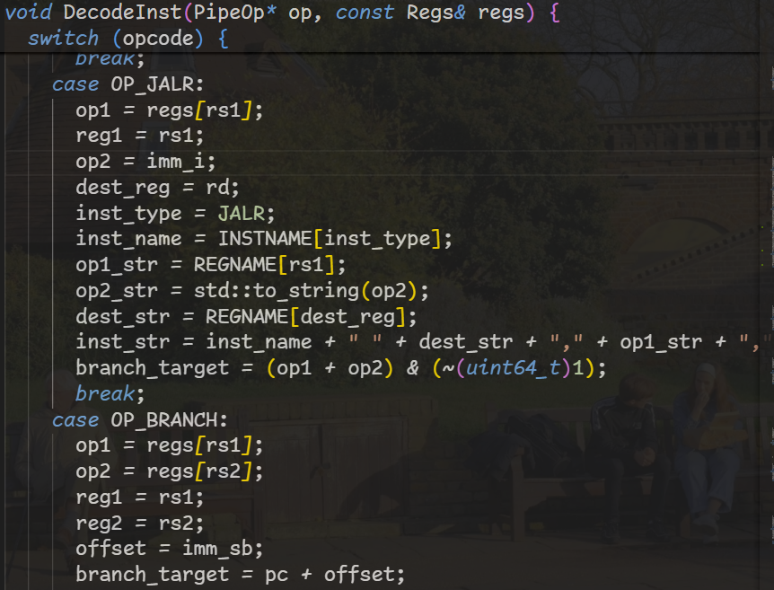

#### 3. mispredicted handling 
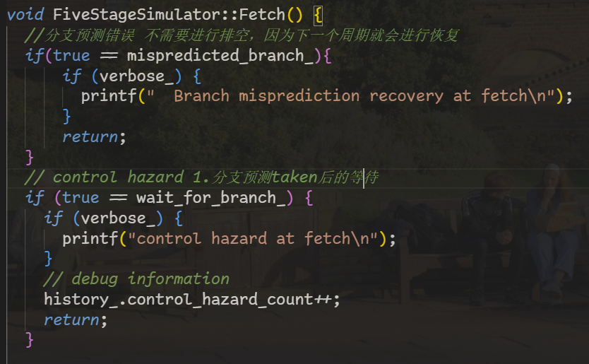

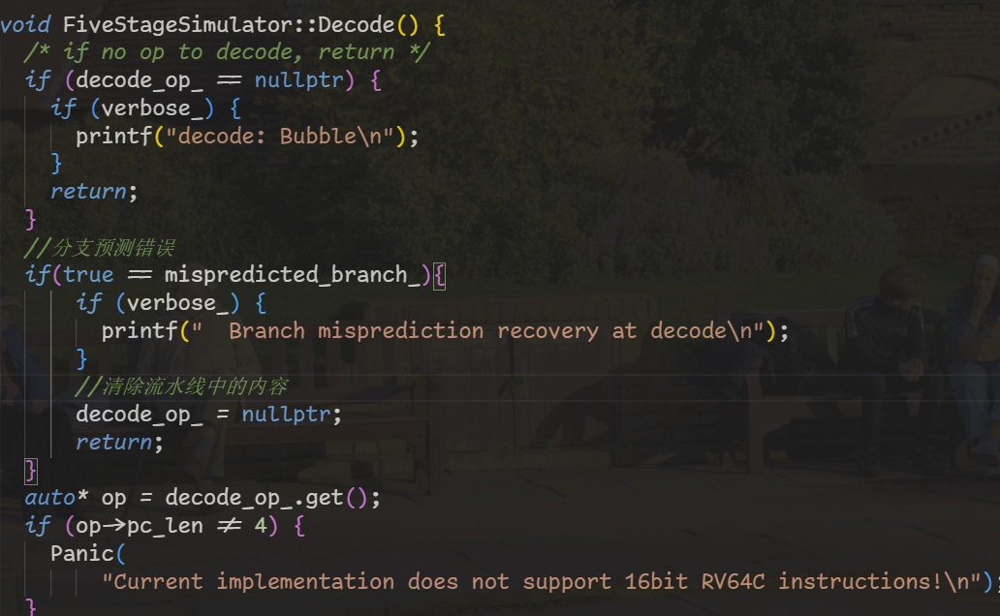

#### 4. predicting logic in decode stage
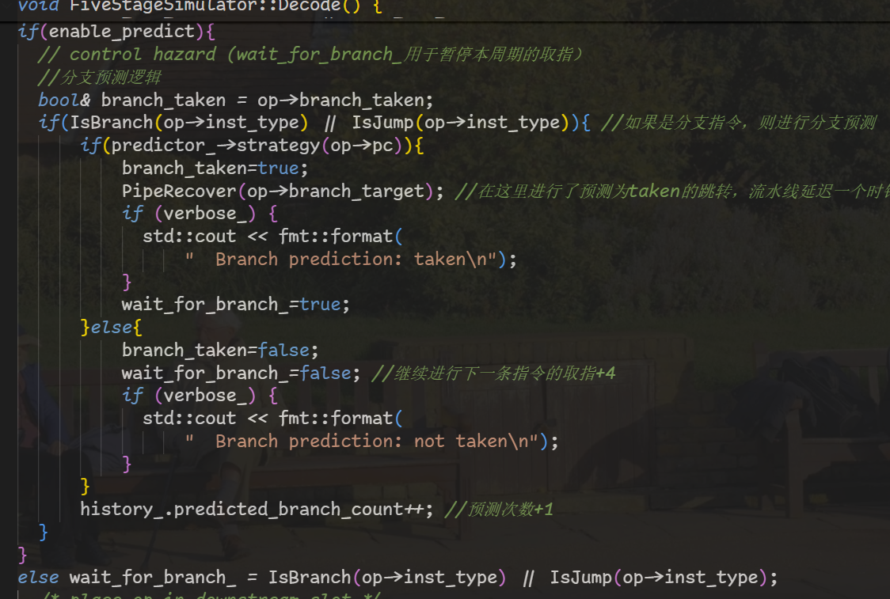

#### 5. predict verification in execute stage
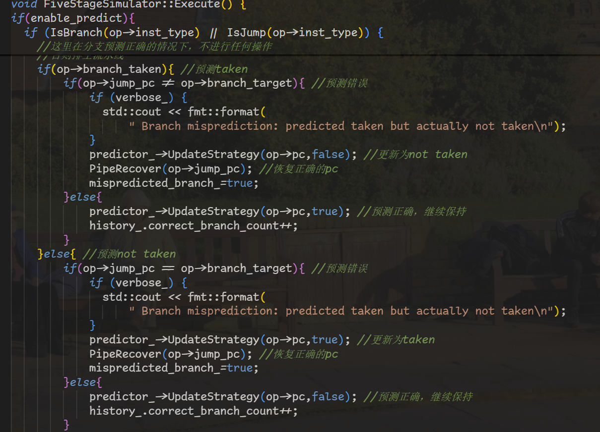

*   A comprehensive evaluation comparing the predictors, covering their parameter settings, hardware costs, and measured performance, along with an analysis explaining the observed differences..
### test_branch程序
#### 1. Always Not Taken (NT)
```txt
 ./build/simulator -i test/build/with-syscall/test_branch.riscv  --branch_predict_policy "Always Not Taken (NT)"
Yes, f2 is true
a[5] = 1 2 3 4 5 
a[5] = 1 12 123 1234 12345 
Program exit from an exit() system call
------------ STATISTICS -----------
Number of Instructions: 1159
Number of Cycles: 2703
Avg Cycles per Instrcution: 2.3322
Number of Control Hazards: 368
Number of Data Hazards: 1175
Branch Prediction Accuracy: 6.12% (12 / 196) 
```
#### 2. Always Taken (AT)
```txt
./build/simulator -i test/build/with-syscall/test_branch.riscv  --branch_predict_policy "Always Taken (AT)"
Yes, f2 is true
a[5] = 1 2 3 4 5 
a[5] = 1 12 123 1234 12345 
Program exit from an exit() system call
------------ STATISTICS -----------
Number of Instructions: 1159
Number of Cycles: 2545
Avg Cycles per Instrcution: 2.1959
Number of Control Hazards: 208
Number of Data Hazards: 1177
Branch Prediction Accuracy: 93.88% (184 / 196)
```
#### 3. One-bit Predictor (1-Bit)
```txt
./build/simulator -i test/build/with-syscall/test_branch.riscv  --branch_predict_policy "One-bit Predictor (1-Bit)"
Yes, f2 is true
a[5] = 1 2 3 4 5 
a[5] = 1 12 123 1234 12345 
Program exit from an exit() system call
------------ STATISTICS -----------
Number of Instructions: 1159
Number of Cycles: 2556
Avg Cycles per Instrcution: 2.2053
Number of Control Hazards: 221
Number of Data Hazards: 1175
Branch Prediction Accuracy: 87.24% (171 / 196) 
```
#### 4. Two-bit Predictor (2-Bit)
```txt
Program exit from an exit() system call
------------ STATISTICS -----------
Number of Instructions: 1159
Number of Cycles: 2548
Avg Cycles per Instrcution: 2.1984
Number of Control Hazards: 211
Number of Data Hazards: 1177
Branch Prediction Accuracy: 91.84% (180 / 196) 
```
#### 5. Perceptron Predictor
```txt
Program exit from an exit() system call
------------ STATISTICS -----------
Number of Instructions: 1159
Number of Cycles: 2566
Avg Cycles per Instrcution: 2.2140
Number of Control Hazards: 231
Number of Data Hazards: 1175
Branch Prediction Accuracy: 79.08% (155 / 196) 
```
#### 6. NO prediction
```txt
./build/simulator -i test/build/with-syscall/test_branch.riscv
Yes, f2 is true
a[5] = 1 2 3 4 5 
a[5] = 1 12 123 1234 12345 
Program exit from an exit() system call
------------ STATISTICS -----------
Number of Instructions: 1159
Number of Cycles: 2727
Avg Cycles per Instrcution: 2.3529
Number of Control Hazards: 392
Number of Data Hazards: 1175
Branch Prediction Accuracy: 0.00% (0 / 0) 
```

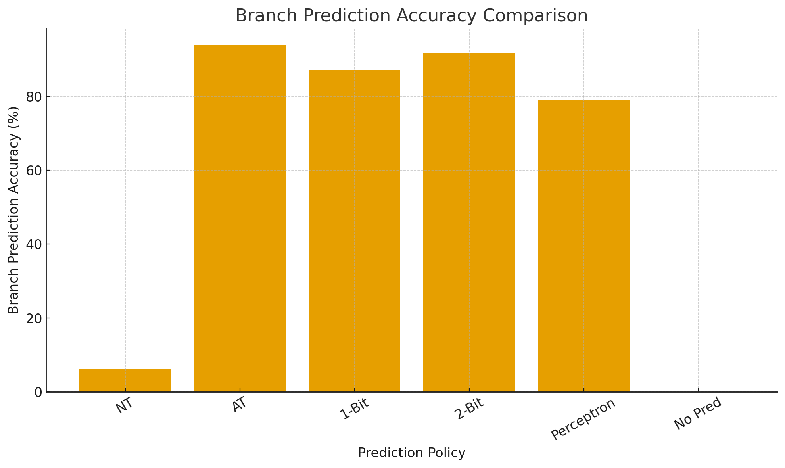
| Strategy                      | Accuracy   | Performance / Notes                                                                                                    |
| ----------------------------- | ---------- | ---------------------------------------------------------------------------------------------------------------------- |
| **Always Not Taken (NT)**     | **6.12%**  | Essentially no predictive power; only works in programs where branches are almost never taken.                         |
| **Always Taken (AT)**         | **93.88%** | Performs very well here because most branches in this test program are taken.                                          |
| **One-bit Predictor (1-Bit)** | **87.24%** | Learns the last branch behavior, but can be affected by loop-boundary oscillations.                                    |
| **Two-bit Predictor (2-Bit)** | **91.84%** | Adds hysteresis to reduce misprediction on loop-boundary oscillations, more robust than 1-bit.                         |
| **Perceptron Predictor**      | **79.08%** | Can learn long histories, but in this test program branch correlations are weak, so advantages are not fully realized. |
| **No Prediction**             | **0%**     | Makes no prediction; degenerates to always stalling.                                                                   |


### Ackermann程序测试
#### 1. Always Not Taken (NT)
```txt
 ./build/simulator -i test/build/with-syscall/test_branch.riscv  --branch_predict_policy "Always Not Taken (NT)"
Program exit from an exit() system call
------------ STATISTICS -----------
Number of Instructions: 431309
Number of Cycles: 978555
Avg Cycles per Instrcution: 2.2688
Number of Control Hazards: 96210
Number of Data Hazards: 451035
Branch Prediction Accuracy: 22.35% (13847 / 61952) 
```
#### 2. Always Taken (AT)
```txt
./build/simulator -i test/build/with-syscall/ackermann.riscv  -p --branch_predict_policy "Always Taken (AT)"
Program exit from an exit() system call
------------ STATISTICS -----------
Number of Instructions: 431309
Number of Cycles: 965073
Avg Cycles per Instrcution: 2.2375
Number of Control Hazards: 75799
Number of Data Hazards: 457964
Branch Prediction Accuracy: 77.65% (48105 / 61952) 
```
#### 3. One-bit Predictor (1-Bit)
```txt
./build/simulator -i test/build/with-syscall/ackermann.riscv  -p --branch_predict_policy "One-bit Predictor (1-Bit)"
------------ STATISTICS -----------
Number of Instructions: 431309
Number of Cycles: 971503
Avg Cycles per Instrcution: 2.2525
Number of Control Hazards: 88915
Number of Data Hazards: 451278
Branch Prediction Accuracy: 56.08% (34745 / 61952)
```
#### 4. Two-bit Predictor (2-Bit)
```txt
./build/simulator -i test/build/with-syscall/ackermann.riscv  -p --branch_predict_policy "Two-bit Predictor (2-Bit)"
Program exit from an exit() system call
------------ STATISTICS -----------
Number of Instructions: 431309
Number of Cycles: 939227
Avg Cycles per Instrcution: 2.1776
Number of Control Hazards: 49954
Number of Data Hazards: 457963
Branch Prediction Accuracy: 98.15% (60805 / 61952) 
```
#### 5. Perceptron Predictor
```txt
./build/simulator -i test/build/with-syscall/ackermann.riscv  -p --branch_predict_policy "Perceptron Predictor"
Program exit from an exit() system call
------------ STATISTICS -----------
Number of Instructions: 431309
Number of Cycles: 938120
Avg Cycles per Instrcution: 2.1751
Number of Control Hazards: 48848
Number of Data Hazards: 457962
Branch Prediction Accuracy: 99.24% (61483 / 61952) 
```

6.NO prediction
```txt
./build/simulator -i test/build/with-syscall/ackermann.riscv 
------------ STATISTICS -----------
Number of Instructions: 431309
Number of Cycles: 1006249
Avg Cycles per Instrcution: 2.3330
Number of Control Hazards: 123904
Number of Data Hazards: 451035
Branch Prediction Accuracy: 0.00% (0 / 0)
-----------------------------------

```
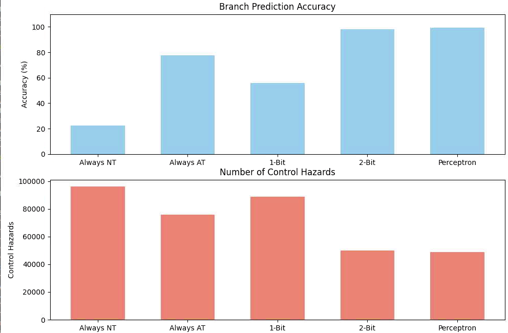
| Predictor             | Prediction Accuracy | Explanation                                                                                                                                                                                                                         |
| --------------------- | ------------------- | ----------------------------------------------------------------------------------------------------------------------------------------------------------------------------------------------------------------------------------- |
| Always Not Taken (NT) | 22.35%              | Always predicts branches as not taken. Most branches in the Ackermann function are actually taken due to deep recursion, so the accuracy is very low and control hazards are high.                                                  |
| Always Taken (AT)     | 77.65%              | Always predicts branches as taken. Most branches are taken, especially in the recursive cases, so accuracy is much higher than NT. Only a few branches at boundary conditions (`m == 0` or `n == 0`) are mispredicted.              |
| One-bit Predictor     | 56.08%              | Uses a single global bit per branch. In the Ackermann function, some branches alternate between taken and not taken frequently, leading to frequent mispredictions and moderate accuracy.                                           |
| Two-bit Predictor     | 98.15%              | Uses a 2-bit saturating counter per branch, which tolerates occasional mispredictions. This works well for the highly regular taken branches in the Ackermann recursion, resulting in very high accuracy and fewer control hazards. |
| Perceptron Predictor  | 99.24%              | Uses global branch history and learned correlations between branches. Captures complex patterns in recursive calls, achieving almost perfect prediction accuracy and the lowest number of control hazards.                          |

### opts
1. use -p option to enable prediction


2. prediction strategy
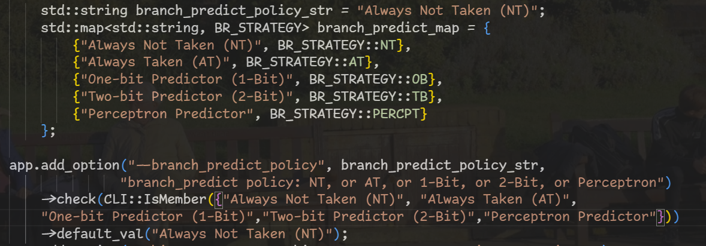

3. Perceptron Predictor parameter set
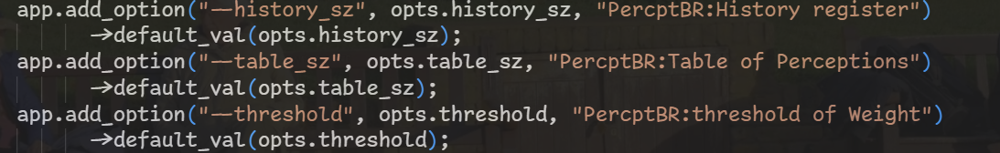
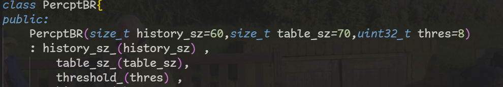

4. Two-bit Predictor (2-Bit) parameter set 

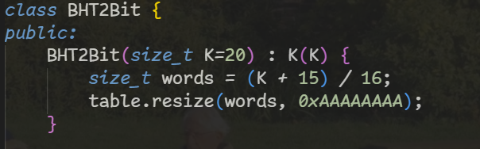

example:
./build/simulator -i test/build/with-syscall/ackermann.riscv  -p --branch_predict_policy "Perceptron Predictor"
---